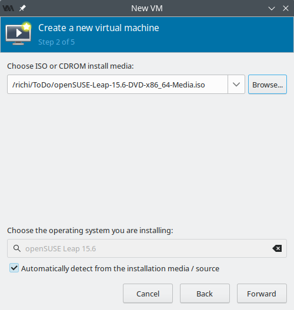
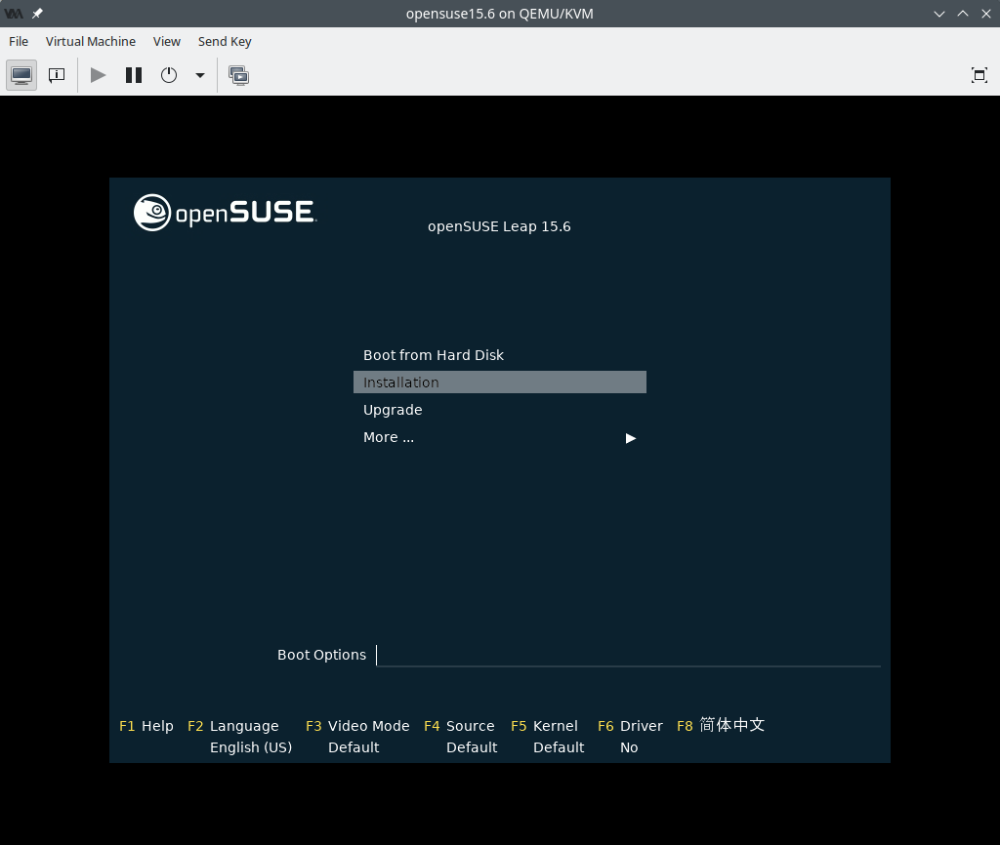
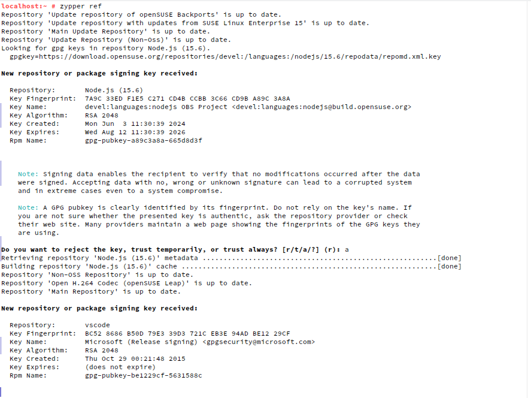
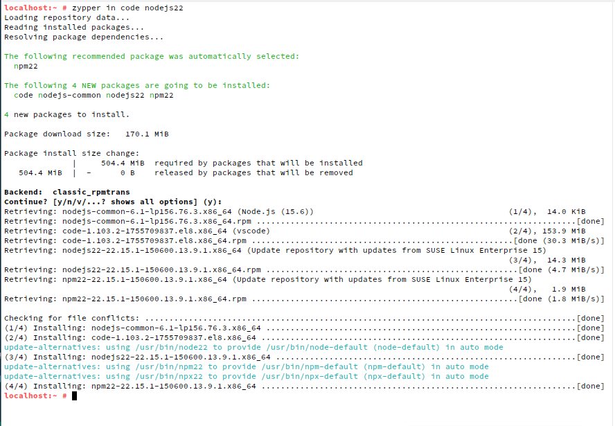

# Optional preparation: Set up a new Virtual Machine

If you want to do this workshop in a completely empty, fresh environment you can follow this guide to set up a new virtual machine.
Here I set up a fresh Virtual Machine in virt-manager/QEMU/KVM and install all the required tools.

Since I like openSUSE Linux, let's get the ISO image for the Leap 15.6 release.

<https://get.opensuse.org/leap/15.6/#download>

I've picked the "Offline Image" as it installs faster. The Network image would also work.


Next I open virt-manager on my current Linux Machine and create a new VM:


I say to create the virtual machine from the downloaded ISO image.



Skip through all the next screens But give the VM Something like 8GB or Ram and boot the virtual machine. In the boot menu choose "Installation"



Pick the correct keyboard layout and accept the license agreement:


Accept the Online Repositories question.

Accept the default list of Online Repositories.

Pick the Desktop with KDE Plasma.

Accept the defaults for Partitioning.

Pick the correct timezone.

Set up a username with a password.

Kick off the install.

It now boots up in openSuse Leap.


Get rid of the Welcome screen.

# Installation of VS Code, NodeJs and Angular


Open up a "Konsole: Root Shell" by clickin on the start menu and searching for "root". The password is that of the user you created with the virtual machine above.


```bash
# Add the VS Code repo
zypper addrepo https://packages.microsoft.com/yumrepos/vscode vscode

# Add the NodeJs repo
zypper addrepo https://download.opensuse.org/repositories/devel:languages:nodejs/15.6/devel:languages:nodejs.repo
```


Next we need to refresh the repos and accept the certificates

```bash
zypper refresh
```



Next we install VS Code, NodeJs22 and git:

```bash
zypper in code nodejs22 git
```


