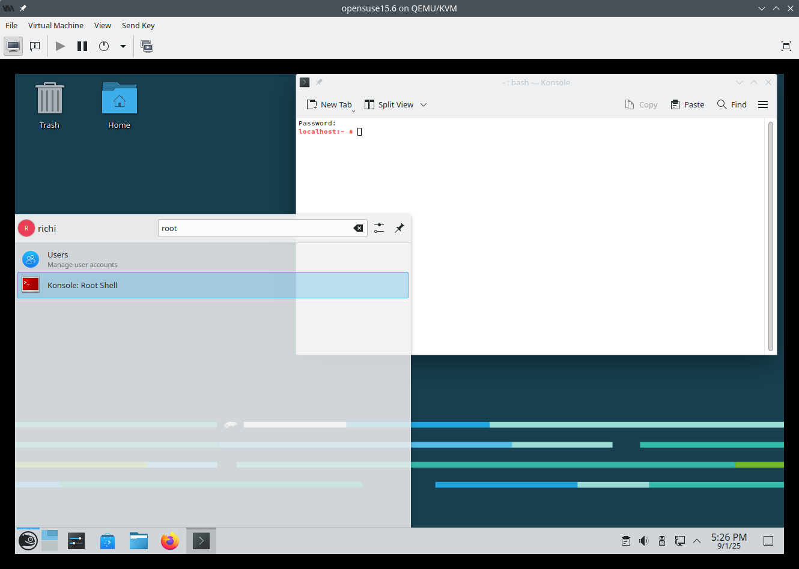

# Workshop to build an Angular App with Signals

Expected duration: 1h

## Preparation: Set up a new Virtual Machine

For this workshop I want to start with a completely clean environment. 
I will therefore set up a fresh Virtual Machine in virt-manager/QEMU/KVM and 
install all the required tools.

Since I like openSUSE Linux, let's get the ISO image for the Leap 15.6 release.

<https://get.opensuse.org/leap/15.6/#download>

I've picked the "Offline Image" as it installs faster. The Network image would also work.


Next I open virt-manager on my current Linux Machine and create a new VM:


I say to create the virtual machine from the downloaded ISO image.


Skip through all the next screens But give the VM Something like 8GB or Ram and boot the virtual machine. In the boot menu choose "Installation"


Pick the correct keyboard layout and accept the license agreement:


Accept the Online Repositories question.

Accept the default list of Online Repositories.

Pick the Desktop with KDE Plasma.

Accept the defaults for Partitioning.

Pick the correct timezone.

Set up a username with a password.

Kick off the install.

It now boots up in openSuse Leap.


Get rid of the Welcome screen.

# Installation of VS Code, NodeJs and Angular


Open up a "Konsole: Root Shell" by clickin on the start menu and searching for "root". The password is that of the user you created with the virtual machine above.



```bash
# Add the VS Code repo
zypper addrepo https://packages.microsoft.com/yumrepos/vscode vscode

# Add the NodeJs repo
zypper addrepo https://download.opensuse.org/repositories/devel:languages:nodejs/15.6/devel:languages:nodejs.repo
```


Next we need to refresh the repos and accept the certificates

```bash
zypper refresh
```


Next we install VS Code, NodeJs22 and git:

```bash
zypper in code nodejs22 git
```


Now install Angular

```bash
npm install -g @angular/cli
```


We are now ready to create our Angular application!

# Creating the Angular Application

LEt's open up VS Code from the Start Menu ("code")

Open a VS Code Terminal from the Menu across the top (maybe hinnden unter the ... menu).

In the terminal type in

```bash
ng new beer-app
```


Let's open the project with VS Code. File > Open Folder > beer-app > Open > Yes, I trust the authors > Do you want to install the recommended 'Angular Language Service' extgenstion > Install > Trust Publisher and Install.

Next let's serve the new app locally:

```bash
ng serve -o
```

And we have a running Angular application being served on port localhost:4200


# The structure of the code

The main page is the src/index.html page. This has a tag `<app-root></app-root>` in it's `<body>` tag. This is replaced by the angular app.

The Angular app comes from the src/app files. Most importantly, the app.ts file is the TypeScript code for the `<app-root></app-root>` tag. In Angular speak this is a Component as indicated with the `@Component`decorator. The selector let Angular find this Component and substitute it in place of the tag on the index.html page. What actually is rendered comes from the templateUrl directive which points to the file `app.html`.

Let's open up app.html, delete all the code in it and replace it with

```html
<h1>Swiss Cantons</h1>
```


# @for Loops

Let's create a list of the cantons in Switzerland. A Canton has a code, a name and a flag. Here is an interface for this type:

```ts
export interface Canton {
  code: string;
  name: string;
  flag: string;
}
```

Past the interface into the file app.ts between the import and @Component on line 4.

Here is an Array of Swiss Cantons. Replace the line 17 `protected readonly title = signal('beer-app');` with the array.

```ts
  cantons: Canton[] = [
    { code: 'AG', name: 'Aargau', flag: 'https://upload.wikimedia.org/wikipedia/commons/thumb/b/b5/Wappen_Aargau_matt.svg/40px-Wappen_Aargau_matt.svg.png' },
    { code: 'AI', name: 'Appenzell Innerrhoden', flag: 'https://upload.wikimedia.org/wikipedia/commons/thumb/b/b7/Wappen_Appenzell_Innerrhoden_matt.svg/40px-Wappen_Appenzell_Innerrhoden_matt.svg.png' },
    { code: 'AR', name: 'Appenzell Ausserrhoden', flag: 'https://upload.wikimedia.org/wikipedia/commons/thumb/2/2c/Wappen_Appenzell_Ausserrhoden_matt.svg/40px-Wappen_Appenzell_Ausserrhoden_matt.svg.png' },
    { code: 'BE', name: 'Bern', flag: 'https://upload.wikimedia.org/wikipedia/commons/thumb/b/b6/CHE_Bern_COA.svg/40px-CHE_Bern_COA.svg.png' },
    { code: 'BL', name: 'Basel-Landschaft', flag: 'https://upload.wikimedia.org/wikipedia/commons/thumb/8/8e/Coat_of_arms_of_Kanton_Basel-Landschaft.svg/40px-Coat_of_arms_of_Kanton_Basel-Landschaft.svg.png' },
    { code: 'BS', name: 'Basel-Stadt', flag: 'https://upload.wikimedia.org/wikipedia/commons/thumb/7/7d/Wappen_Basel-Stadt_matt.svg/40px-Wappen_Basel-Stadt_matt.svg.png'},
    { code: 'FR', name: 'Freiburg', flag: 'https://upload.wikimedia.org/wikipedia/commons/thumb/0/01/Wappen_Freiburg_matt.svg/40px-Wappen_Freiburg_matt.svg.png' },
    { code: 'GE', name: 'Genf', flag: 'https://upload.wikimedia.org/wikipedia/commons/thumb/6/67/CHE_Canton_de_Gen%C3%A8ve_%C3%A9cu_seul_COA.svg/40px-CHE_Canton_de_Gen%C3%A8ve_%C3%A9cu_seul_COA.svg.png'},
    { code: 'GL', name: 'Glarus', flag: 'https://upload.wikimedia.org/wikipedia/commons/thumb/0/0e/Wappen_Glarus_matt.svg/40px-Wappen_Glarus_matt.svg.png'},
    { code: 'GR', name: 'Graubünden', flag: 'https://upload.wikimedia.org/wikipedia/commons/thumb/c/c3/CHE_Graub%C3%BCnden_COA.svg/40px-CHE_Graub%C3%BCnden_COA.svg.png'},
    { code: 'LU', name: 'Luzern', flag: 'https://upload.wikimedia.org/wikipedia/commons/thumb/6/66/Wappen_Luzern_matt.svg/40px-Wappen_Luzern_matt.svg.png'},
    { code: 'NE', name: 'Neuenburg', flag: 'https://upload.wikimedia.org/wikipedia/commons/thumb/d/d1/Wappen_Neuenburg_matt.svg/40px-Wappen_Neuenburg_matt.svg.png'},
    { code: 'NW', name: 'Nidwalden', flag: 'https://upload.wikimedia.org/wikipedia/commons/thumb/b/bd/Wappen_Nidwalden_matt.svg/40px-Wappen_Nidwalden_matt.svg.png'},
    { code: 'OW', name: 'Obwalden', flag: 'https://upload.wikimedia.org/wikipedia/commons/thumb/1/1a/Wappen_Obwalden_matt.svg/40px-Wappen_Obwalden_matt.svg.png'},
    { code: 'SG', name: 'St. Gallen', flag: 'https://upload.wikimedia.org/wikipedia/commons/thumb/c/c5/Coat_of_arms_of_canton_of_St._Gallen.svg/40px-Coat_of_arms_of_canton_of_St._Gallen.svg.png'},
    { code: 'SH', name: 'Schaffhausen', flag: 'https://upload.wikimedia.org/wikipedia/commons/thumb/b/b6/Wappen_Schaffhausen_matt.svg/40px-Wappen_Schaffhausen_matt.svg.png'},
    { code: 'SO', name: 'Solothurn', flag: 'https://upload.wikimedia.org/wikipedia/commons/thumb/b/b7/Wappen_Solothurn_matt.svg/40px-Wappen_Solothurn_matt.svg.png'},
    { code: 'SZ', name: 'Schwyz', flag: 'https://upload.wikimedia.org/wikipedia/commons/thumb/e/ee/Wappen_Schwyz_matt.svg/40px-Wappen_Schwyz_matt.svg.png'},
    { code: 'TG', name: 'Thurgau', flag: 'https://upload.wikimedia.org/wikipedia/commons/thumb/7/71/Wappen_Thurgau_matt.svg/40px-Wappen_Thurgau_matt.svg.png'},
    { code: 'TI', name: 'Tessin', flag: 'https://upload.wikimedia.org/wikipedia/commons/thumb/8/87/Wappen_Tessin_matt.svg/40px-Wappen_Tessin_matt.svg.png'},
    { code: 'UR', name: 'Uri', flag: 'https://upload.wikimedia.org/wikipedia/commons/thumb/1/10/Wappen_Uri_matt.svg/40px-Wappen_Uri_matt.svg.png' },
    { code: 'VD', name: 'Waadt', flag: 'https://upload.wikimedia.org/wikipedia/commons/thumb/1/1d/Wappen_Waadt_matt.svg/40px-Wappen_Waadt_matt.svg.png'},
    { code: 'VS', name: 'Wallis', flag: 'https://upload.wikimedia.org/wikipedia/commons/thumb/a/a3/Wappen_Wallis_matt.svg/40px-Wappen_Wallis_matt.svg.png'},
    { code: 'ZG', name: 'Zug', flag: 'https://upload.wikimedia.org/wikipedia/commons/thumb/3/31/Wappen_Zug_matt.svg/40px-Wappen_Zug_matt.svg.png'},
    { code: 'ZH', name: 'Zürich', flag: 'https://upload.wikimedia.org/wikipedia/commons/thumb/5/5a/Wappen_Z%C3%BCrich_matt.svg/40px-Wappen_Z%C3%BCrich_matt.svg.png'}
  ];
```

and we need to tell Angular that this is a standalone component:

```ts
@Component({
  selector: 'app-root',
  imports: [RouterOutlet],
  templateUrl: './app.html',
  styleUrl: './app.css',
  standalone: true
})
```

Now head back to the app.html file and add the following code underneath the h1 tag:

```html
<table>
@for (canton of cantons; track canton.code) {
    <tr>
      <td></td>  
      <td>{{canton.code}}</td>
      <td>{{canton.name}}</td>
    </tr>
}
</table>
```


But what happend to the Canton of Jura? It was left out.
Let's add a button that calls a function to add it to the list:

```html
<h1>Swiss Cantons</h1>
<button (click)="addJura()">Add Jura</button>
<table>
@for (canton of cantons; track canton.code) {
    <tr>
      <td></td>  
      <td>{{canton.code}}</td>
      <td>{{canton.name}}</td>
    </tr>
}
</table>
```

And we need to add the addJura() function in the app.ts file:

```ts
  addJura() {
    let cantonJura:Canton = { code: 'JU', name: 'Jura', flag: 'https://upload.wikimedia.org/wikipedia/commons/thumb/f/f0/Wappen_Jura_matt.svg/40px-Wappen_Jura_matt.svg.png'};
    this.cantons.push(cantonJura);
  }
```

Try it out.

Annoyingly Jura actually shows up. This is due to Angular's change detection mechanism. It realised that the underlying array has changed and that it needs to refresh the @for view. I wanted it not to happen to seguay to Angular Signals which are the latest and most reliable way Angular does change detection.


    { code: 'JU', name: 'Jura', flag: 'https://upload.wikimedia.org/wikipedia/commons/thumb/f/f0/Wappen_Jura_matt.svg/40px-Wappen_Jura_matt.svg.png'},


Create a @for loop to list the Swiss Cantons
Set up a GitHub repo for the project and commit the application
Let's remove Jura and add it dynamically
