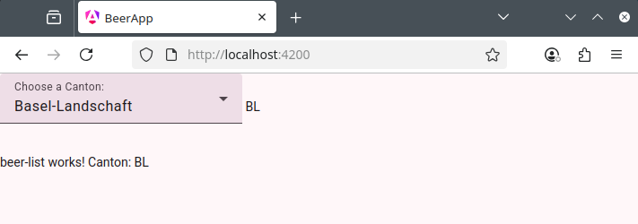

# Workshop to build an Angular App with Signals

Expected duration: 1h

## Prerequisites

You need to have NodeJS installed. VS Code is probably your editor of choice but YMMV.

If you type in the following commands and get a similar response you should be OK to follow this workshop.

```bash
richi@localhost:~> node -v
v22.15.1
richi@localhost:~> npm -v
11.4.2
```

## Install Angular

Now install Angular

```bash
# note: I had to run this as root
npm install -g @angular/cli
```


```bash{3}
# check the version of Angular that is installed:
# (back as non-root)
ng v
```

```

     _                      _                 ____ _     ___
    / \   _ __   __ _ _   _| | __ _ _ __     / ___| |   |_ _|
   / △ \ | '_ \ / _` | | | | |/ _` | '__|   | |   | |    | |
  / ___ \| | | | (_| | |_| | | (_| | |      | |___| |___ | |
 /_/   \_\_| |_|\__, |\__,_|_|\__,_|_|       \____|_____|___|
                |___/
    


Angular CLI: 20.2.2
Node: 22.15.1
Package Manager: npm 11.4.2
OS: linux x64
    

Angular: <error>

Package                      Version
------------------------------------
@angular-devkit/architect    0.2002.2 (cli-only)
@angular-devkit/core         20.2.2 (cli-only)
@angular-devkit/schematics   20.2.2 (cli-only)
@schematics/angular          20.2.2 (cli-only)
```

If you have a version of 20.x of Angular this tutorial should work. (The component naming was changed from 19 to 20 which breaks a number of tutorials that expect the name of `mycomponent.component.ts` instead of the new `mycomponent.ts` convetion.)

We are now ready to create our Angular application!

# Creating the Angular Application

You can set up the app from a terminal inside VS Code but I would do this on the command line and then `cd` to the new directory and open VS Code there.

```bash
ng new beer-app
```

```
# Angular will ask you a number of questions. Some may be different or omitted if you have done this before.

 Would you like to enable autocompletion? This will set up your terminal so pressing TAB while typing Angular CLI commands will show 
possible options and autocomplete arguments. (Enabling autocompletion will modify configuration files in your home directory.) Yes

Appended `source <(ng completion script)` to `/home/richi/.bashrc`. Restart your terminal or run the following to autocomplete `ng` commands:

    source <(ng completion script)
 
Would you like to share pseudonymous usage data about this project with the Angular Team
at Google under Google's Privacy Policy at https://policies.google.com/privacy. For more
details and how to change this setting, see https://angular.dev/cli/analytics.

   No


Global setting: disabled
Local setting: No local workspace configuration file.
Effective status: disabled

# pick th CSS option for this tutorial:
✔ Which stylesheet format would you like to use? CSS             [ https://developer.mozilla.org/docs/Web/CSS
                     ]
✔ Do you want to enable Server-Side Rendering (SSR) and Static Site Generation (SSG/Prerendering)? No

✔ Do you want to create a 'zoneless' application without zone.js? No

✔ Which AI tools do you want to configure with Angular best practices? https://angular.dev/ai/develop-with-ai None
CREATE beer-app/README.md (1470 bytes)
CREATE beer-app/.editorconfig (314 bytes)
CREATE beer-app/.gitignore (587 bytes)
CREATE beer-app/angular.json (2402 bytes)
CREATE beer-app/package.json (1131 bytes)
CREATE beer-app/tsconfig.json (992 bytes)
CREATE beer-app/tsconfig.app.json (429 bytes)
CREATE beer-app/tsconfig.spec.json (408 bytes)
CREATE beer-app/.vscode/extensions.json (130 bytes)
CREATE beer-app/.vscode/launch.json (470 bytes)
CREATE beer-app/.vscode/tasks.json (938 bytes)
CREATE beer-app/src/main.ts (222 bytes)
CREATE beer-app/src/index.html (293 bytes)
CREATE beer-app/src/styles.css (80 bytes)
CREATE beer-app/src/app/app.css (0 bytes)
CREATE beer-app/src/app/app.spec.ts (666 bytes)
CREATE beer-app/src/app/app.ts (290 bytes)
CREATE beer-app/src/app/app.html (20122 bytes)
CREATE beer-app/src/app/app.config.ts (400 bytes)
CREATE beer-app/src/app/app.routes.ts (77 bytes)
CREATE beer-app/public/favicon.ico (15086 bytes)
✔ Packages installed successfully.
hint: Using 'master' as the name for the initial branch. This default branch name
hint: is subject to change. To configure the initial branch name to use in all
hint: of your new repositories, which will suppress this warning, call:
hint:
hint:   git config --global init.defaultBranch <name>
hint:
hint: Names commonly chosen instead of 'master' are 'main', 'trunk' and
hint: 'development'. The just-created branch can be renamed via this command:
hint:
hint:   git branch -m <name>
hint:
hint: Disable this message with "git config set advice.defaultBranchName false"
    Successfully initialized git.
```

Let's open the project with VS Code. File > Open Folder > beer-app > Open > Yes, I trust the authors > Do you want to install the recommended 'Angular Language Service' extgenstion > Install > Trust Publisher and Install.

Next let's serve the new app locally.

Open up VS Code and `File > Open Folder` the new beer-app directory

Open a VS Code Terminal from the Menu across the top (maybe hidden unter the ... menu).

In the terminal type in

```bash
ng serve -o
```

And we have a running Angular application being served on port localhost:4200 !


# The structure of the code

The main page is the `src/index.html` page. This has a tag `<app-root></app-root>` in it's `<body>` tag. This is replaced by the angular app.

The Angular app comes from the `src/app` files. Most importantly, the `app.ts` file is the TypeScript code for the `<app-root></app-root>` tag. In Angular-speak this is a Component as indicated with the `@Component`decorator. The selector `app-root`let Angular find this Component and substitute it in place of the `<app-root></app-root>` tag on the index.html page. What actually is rendered comes from the `templateUrl` directive which points to the file `app.html`.

# A List of Swiss Cantons

Let's open up `app.html`, delete all the code in it and replace it with

```html
<h1>Swiss Cantons</h1>
```


Did you notice the WARNING in the VS Code Terminal window? `ng serve` constantly recompiles the code and any errors it encounters are shown in the terminal. To fix this error let's remove the `RouterOutlet` from the `app.ts` file. This is super useful for making your pages respond to the /thingYouWantToDo part of your URL but we won't get to that in this tutorial.

```diff
# in app.ts
- imports: [RouterOutlet],
+ imports: [],
```

## We need the data

Let's create a list of the cantons in Switzerland. A Canton has a code, a name and a flag. Let's also record the offical languages used in the canton. Here is an Typescript interface for this type:

```ts
export interface Canton {
  code: string;
  languages: string[];
  name: string;
  flag: string;
}
```

Paste the interface definition into the file `app.ts` between the `import` and `@Component` on line 4. This is arguably not the best place to put it but we will rearrange that later when we get to services.

Here is an Array of Swiss Cantons. Replace line 17 with the array.

```diff
- protected readonly title = signal('beer-app');
+ cantons: Canton[] = [
   { code: 'AG', languages: ['DE'], name: 'Aargau', flag: 'https://upload.wikimedia.org/wikipedia/commons/thumb/b/b5/Wappen_Aargau_matt.svg/40px-Wappen_Aargau_matt.svg.png' },
   { code: 'AI', languages: ['DE'], name: 'Appenzell Innerrhoden', flag: 'https://upload.wikimedia.org/wikipedia/commons/thumb/b/b7/Wappen_Appenzell_Innerrhoden_matt.svg/40px-Wappen_Appenzell_Innerrhoden_matt.svg.png' },
   { code: 'AR', languages: ['DE'], name: 'Appenzell Ausserrhoden', flag: 'https://upload.wikimedia.org/wikipedia/commons/thumb/2/2c/Wappen_Appenzell_Ausserrhoden_matt.svg/40px-Wappen_Appenzell_Ausserrhoden_matt.svg.png' },
   { code: 'BE', languages: ['DE'], name: 'Bern', flag: 'https://upload.wikimedia.org/wikipedia/commons/thumb/b/b6/CHE_Bern_COA.svg/40px-CHE_Bern_COA.svg.png' },
   { code: 'BL', languages: ['DE'], name: 'Basel-Landschaft', flag: 'https://upload.wikimedia.org/wikipedia/commons/thumb/8/8e/Coat_of_arms_of_Kanton_Basel-Landschaft.svg/40px-Coat_of_arms_of_Kanton_Basel-Landschaft.svg.png' },
   { code: 'BS', languages: ['DE'], name: 'Basel-Stadt', flag: 'https://upload.wikimedia.org/wikipedia/commons/thumb/7/7d/Wappen_Basel-Stadt_matt.svg/40px-Wappen_Basel-Stadt_matt.svg.png'},
   { code: 'FR', languages: ['DE', 'FR'], name: 'Freiburg', flag: 'https://upload.wikimedia.org/wikipedia/commons/thumb/0/01/Wappen_Freiburg_matt.svg/40px-Wappen_Freiburg_matt.svg.png' },
   { code: 'GE', languages: ['FR'], name: 'Genf', flag: 'https://upload.wikimedia.org/wikipedia/commons/thumb/6/67/CHE_Canton_de_Gen%C3%A8ve_%C3%A9cu_seul_COA.svg/40px-CHE_Canton_de_Gen%C3%A8ve_%C3%A9cu_seul_COA.svg.png'},
   { code: 'GL', languages: ['DE'], name: 'Glarus', flag: 'https://upload.wikimedia.org/wikipedia/commons/thumb/0/0e/Wappen_Glarus_matt.svg/40px-Wappen_Glarus_matt.svg.png'},
   { code: 'GR', languages: ['DE', 'RM', 'IT'], name: 'Graubünden', flag: 'https://upload.wikimedia.org/wikipedia/commons/thumb/c/c3/CHE_Graub%C3%BCnden_COA.svg/40px-CHE_Graub%C3%BCnden_COA.svg.png'},
   { code: 'LU', languages: ['DE'], name: 'Luzern', flag: 'https://upload.wikimedia.org/wikipedia/commons/thumb/6/66/Wappen_Luzern_matt.svg/40px-Wappen_Luzern_matt.svg.png'},
   { code: 'NE', languages: ['FR'], name: 'Neuenburg', flag: 'https://upload.wikimedia.org/wikipedia/commons/thumb/d/d1/Wappen_Neuenburg_matt.svg/40px-Wappen_Neuenburg_matt.svg.png'},
   { code: 'NW', languages: ['DE'], name: 'Nidwalden', flag: 'https://upload.wikimedia.org/wikipedia/commons/thumb/b/bd/Wappen_Nidwalden_matt.svg/40px-Wappen_Nidwalden_matt.svg.png'},
   { code: 'OW', languages: ['DE'], name: 'Obwalden', flag: 'https://upload.wikimedia.org/wikipedia/commons/thumb/1/1a/Wappen_Obwalden_matt.svg/40px-Wappen_Obwalden_matt.svg.png'},
   { code: 'SG', languages: ['DE'], name: 'St. Gallen', flag: 'https://upload.wikimedia.org/wikipedia/commons/thumb/c/c5/Coat_of_arms_of_canton_of_St._Gallen.svg/40px-Coat_of_arms_of_canton_of_St._Gallen.svg.png'},
   { code: 'SH', languages: ['DE'], name: 'Schaffhausen', flag: 'https://upload.wikimedia.org/wikipedia/commons/thumb/b/b6/Wappen_Schaffhausen_matt.svg/40px-Wappen_Schaffhausen_matt.svg.png'},
   { code: 'SO', languages: ['DE'], name: 'Solothurn', flag: 'https://upload.wikimedia.org/wikipedia/commons/thumb/b/b7/Wappen_Solothurn_matt.svg/40px-Wappen_Solothurn_matt.svg.png'},
   { code: 'SZ', languages: ['DE'], name: 'Schwyz', flag: 'https://upload.wikimedia.org/wikipedia/commons/thumb/e/ee/Wappen_Schwyz_matt.svg/40px-Wappen_Schwyz_matt.svg.png'},
   { code: 'TG', languages: ['DE'], name: 'Thurgau', flag: 'https://upload.wikimedia.org/wikipedia/commons/thumb/7/71/Wappen_Thurgau_matt.svg/40px-Wappen_Thurgau_matt.svg.png'},
   { code: 'TI', languages: ['IT'], name: 'Tessin', flag: 'https://upload.wikimedia.org/wikipedia/commons/thumb/8/87/Wappen_Tessin_matt.svg/40px-Wappen_Tessin_matt.svg.png'},
   { code: 'UR', languages: ['DE'], name: 'Uri', flag: 'https://upload.wikimedia.org/wikipedia/commons/thumb/1/10/Wappen_Uri_matt.svg/40px-Wappen_Uri_matt.svg.png' },
   { code: 'VD', languages: ['FR'], name: 'Waadt', flag: 'https://upload.wikimedia.org/wikipedia/commons/thumb/1/1d/Wappen_Waadt_matt.svg/40px-Wappen_Waadt_matt.svg.png'},
   { code: 'VS', languages: ['DE', 'FR'], name: 'Wallis', flag: 'https://upload.wikimedia.org/wikipedia/commons/thumb/a/a3/Wappen_Wallis_matt.svg/40px-Wappen_Wallis_matt.svg.png'},
   { code: 'ZG', languages: ['DE'], name: 'Zug', flag: 'https://upload.wikimedia.org/wikipedia/commons/thumb/3/31/Wappen_Zug_matt.svg/40px-Wappen_Zug_matt.svg.png'},
   { code: 'ZH', languages: ['DE'], name: 'Zürich', flag: 'https://upload.wikimedia.org/wikipedia/commons/thumb/5/5a/Wappen_Z%C3%BCrich_matt.svg/40px-Wappen_Z%C3%BCrich_matt.svg.png'}
  ];
```

We may need to tell Angular that this is a standalone component (which is the modern way to do Angular; modules still work fine for the time beeing):

```diff
@Component({
  selector: 'app-root',
  imports: [RouterOutlet],
  templateUrl: './app.html',
  styleUrl: './app.css',
+  standalone: true
})
```

## @for Loops

Now head back to the app.html file and add the following code underneath the `<h1>` tag:

```html{2}
<table>
@for (canton of cantons; track canton.code) {
    <tr>
      <td></td>
      <td>{{canton.code}}</td>
      <td>{{canton.name}}</td>
    </tr>
}
</table>
```


The `@for` directive in the `app.html` file iterated over our array of Cantons and produced a `<tr>`element for each canton!

## Change detection and filtering - Signals

Let's put down some checkboxes to filter the cantons by the languages spoken there.

Let's create some boolean variables in the `app.ts` file, inside the app class:

```typescript
  german: boolean = true;
  french: boolean = true;
  italian: boolean = true;
  romansh: boolean = true;
```

Then we create the checkboxes on the `app.html` file under the `<h1>` tag. Note that we use the [(ngModel)] directive to bind the checkbox to the variable in the TypeScript file.

```html
<label for="German">German</label>
<input type="checkbox" name="German" [(ngModel)]="german"><br>
<label for="French">French</label>
<input type="checkbox" name="French" [(ngModel)]="french"><br>
<label for="Italian">Italian</label>
<input type="checkbox" name="Italian" [(ngModel)]="italian"><br>
<label for="Romansh">Romansh</label>
<input type="checkbox" name="Romansh" [(ngModel)]="romansh"><br>
```

The Angular Compiler will now moan about not knowing what the ngModel directive is. We fix this by adding the FormsModule to the imports:

```diff
# add this to the top of the app.ts file
+ import { FormsModule } from '@angular/forms';

# and change the imports directive:
- imports: [],
+ imports: [FormsModule],
```

We now have the checkboxes on the screen but when we click on them nothing happens. One approach would be to have a filter button that creates a new list. The special `(click)="filter()"` notation is an Angular thing that says when you click the button call the `filter()` function in the `app.ts` class.

Add a button to the `app.html` file:

```html
<button (click)="filter()">Run the Filter</button>
```

Add the filter() function to the the `app.ts`class:

```TypeScript
  filteredCantons: Canton[] = this.cantons;
  filter() {
    this.filteredCantons = this.cantons.filter(canton => {
      return (this.german && canton.languages.includes('DE')) ||
              (this.french && canton.languages.includes('FR')) ||
              (this.italian && canton.languages.includes('IT')) ||
              (this.romansh && canton.languages.includes('RM'));
    })
  }
```

Still nothing happens! We need to use the `filteredCantons` in our `@for` loop instead of the `cantons` array:

```diff
- @for (canton of cantons; track canton.code) {
+ @for (canton of filteredCantons; track canton.code) {
```

We now have something that works. But wait, what happened to the canton of Jura? They were only spun off from Berne in 1979. We seem to have missed them. Let's add a button to add the missing canton:

Add this to `app.html`:

```html
<button (click)="addJura()">Add Jura</button>
```

And we need to add the addJura() function in the app.ts file:

```ts
  addJura() {
    let cantonJura:Canton = { code: 'JU', languages: ['FR'], name: 'Jura', flag: 'https://upload.wikimedia.org/wikipedia/commons/thumb/f/f0/Wappen_Jura_matt.svg/40px-Wappen_Jura_matt.svg.png'};
    this.cantons.push(cantonJura);
  }
```

Try it out.

But nothing happens when we click on the Add Jura button! If we click on the "Run the Filter" button it shows up.

Of course this is because we are adding the canton of Jura to the `cantons`  array and not the `filteredCantons` array. We could fix that by calling the `filter()` function from the `addJura` function. But then we have to remember all the places we are doing this. Angular offers a better solution: Signals. A Signal wraps a piece of data with a change detection mechanism which informs dependant pieces of data to refresh and recalculate themselves (think Excel formulas).

## Converting to Signals

Let's make our language booleans a signal:

```diff
# add to the top of app.ts:
+ import { signal, computed } from '@angular/core';

- german: boolean = true;
- french: boolean = true;
- italian: boolean = true;
- romansh: boolean = true;
+ german = signal(true);
+ french = signal(true);
+ italian = signal(true);
+ romansh = signal(true);
# don't keep the + (plus) Signs in front of the lines!
```

We need to make our cantons array a signal:

```diff
- cantons: Canton[] = [
+ cantons = signal<Canton[]>([
    [...]
-  ];
+  ]); # don't forget the extra closing brace at the bottom of the list!
 
```

Remove the "Run The Filter" button in `app.html`

Remove the `filter()` function in `app.ts`:

```diff
-  filter() {
-    this.filteredCantons = this.cantons.filter(canton => {
-      return (this.german && canton.languages.includes('DE')) ||
-              (this.french && canton.languages.includes('FR')) ||
-              (this.italian && canton.languages.includes('IT')) ||
-              (this.romansh && canton.languages.includes('RM'));
-    })
-  }
```

Turn the `filteredCantons` into a computed signal:

```typescript
// replace
filteredCantons: Canton[] = this.cantons;
// with
  filteredCantons = computed(() => {
    const selectedLanguages: string[] = [];
    if (this.german()) selectedLanguages.push('DE');
    if (this.french()) selectedLanguages.push('FR');
    if (this.italian()) selectedLanguages.push('IT');
    if (this.romansh()) selectedLanguages.push('RM');

    // If no languages are selected, show all cantons.
    // Otherwise, filter the cantons array.
    if (selectedLanguages.length === 0) {
      return this.cantons();
    }
    
    return this.cantons().filter(canton => 
      canton.languages.some(lang => selectedLanguages.includes(lang))
    );
  });
```

Change this line in the addJura function in `app.ts`

```diff
-  this.cantons.push(cantonJura);
+  this.cantons.update(currentCantons => [...currentCantons, cantonJura]);
```

And we need to change the @for from an array to a signal:

```diff
- filteredCantons
+ filteredCantons()
```

Now everything is linked together with Signals and everything is reacting automatically to the underlying data changes!

## Take the data away into a service

The data has no business being in there with the component that is rendering and filtering it. We should take it out and move it into a service. The service can then be injected to a compent that requires it.

Open a new terminal window and type the `ng generate` command as follows:

```bash
richi@localhost:~/beer-app> ng generate service cantonService
CREATE src/app/canton-service.spec.ts (357 bytes)
CREATE src/app/canton-service.ts (117 bytes)
```

If you check the `cantonService.ts` file you will notice the `@Injectable` decorator. This marks this class as one that can be injected into other classes when it is needed.

From our App class we now want to remove the `cantons`and `filteredCantons` signals and instead add them to the `CantonService` class. Also move the language signals. And the Canton interface.

Update the import so that the `signal` and `computed` is imported:

```diff
- import { Injectable } from '@angular/core';
+ import { Injectable, signal, computed } from '@angular/core';
```

The CantonService will end up looking like this:

```typescript
import { Injectable, signal, computed } from '@angular/core';

export interface Canton {
  code: string;
  languages: string[];
  name: string;
  flag: string;
}

@Injectable({
  providedIn: 'root'
})
export class CantonService {
   cantons = signal<Canton[]>([
   { code: 'AG', languages: ['DE'], name: 'Aargau', flag: 'https://upload.wikimedia.org/wikipedia/commons/thumb/b/b5/Wappen_Aargau_matt.svg/40px-Wappen_Aargau_matt.svg.png' },
   { code: 'AI', languages: ['DE'], name: 'Appenzell Innerrhoden', flag: 'https://upload.wikimedia.org/wikipedia/commons/thumb/b/b7/Wappen_Appenzell_Innerrhoden_matt.svg/40px-Wappen_Appenzell_Innerrhoden_matt.svg.png' },
   { code: 'AR', languages: ['DE'], name: 'Appenzell Ausserrhoden', flag: 'https://upload.wikimedia.org/wikipedia/commons/thumb/2/2c/Wappen_Appenzell_Ausserrhoden_matt.svg/40px-Wappen_Appenzell_Ausserrhoden_matt.svg.png' },
   { code: 'BE', languages: ['DE'], name: 'Bern', flag: 'https://upload.wikimedia.org/wikipedia/commons/thumb/b/b6/CHE_Bern_COA.svg/40px-CHE_Bern_COA.svg.png' },
   { code: 'BL', languages: ['DE'], name: 'Basel-Landschaft', flag: 'https://upload.wikimedia.org/wikipedia/commons/thumb/8/8e/Coat_of_arms_of_Kanton_Basel-Landschaft.svg/40px-Coat_of_arms_of_Kanton_Basel-Landschaft.svg.png' },
   { code: 'BS', languages: ['DE'], name: 'Basel-Stadt', flag: 'https://upload.wikimedia.org/wikipedia/commons/thumb/7/7d/Wappen_Basel-Stadt_matt.svg/40px-Wappen_Basel-Stadt_matt.svg.png'},
   { code: 'FR', languages: ['DE', 'FR'], name: 'Freiburg', flag: 'https://upload.wikimedia.org/wikipedia/commons/thumb/0/01/Wappen_Freiburg_matt.svg/40px-Wappen_Freiburg_matt.svg.png' },
   { code: 'GE', languages: ['FR'], name: 'Genf', flag: 'https://upload.wikimedia.org/wikipedia/commons/thumb/6/67/CHE_Canton_de_Gen%C3%A8ve_%C3%A9cu_seul_COA.svg/40px-CHE_Canton_de_Gen%C3%A8ve_%C3%A9cu_seul_COA.svg.png'},
   { code: 'GL', languages: ['DE'], name: 'Glarus', flag: 'https://upload.wikimedia.org/wikipedia/commons/thumb/0/0e/Wappen_Glarus_matt.svg/40px-Wappen_Glarus_matt.svg.png'},
   { code: 'GR', languages: ['DE', 'RM', 'IT'], name: 'Graubünden', flag: 'https://upload.wikimedia.org/wikipedia/commons/thumb/c/c3/CHE_Graub%C3%BCnden_COA.svg/40px-CHE_Graub%C3%BCnden_COA.svg.png'},
   { code: 'LU', languages: ['DE'], name: 'Luzern', flag: 'https://upload.wikimedia.org/wikipedia/commons/thumb/6/66/Wappen_Luzern_matt.svg/40px-Wappen_Luzern_matt.svg.png'},
   { code: 'NE', languages: ['FR'], name: 'Neuenburg', flag: 'https://upload.wikimedia.org/wikipedia/commons/thumb/d/d1/Wappen_Neuenburg_matt.svg/40px-Wappen_Neuenburg_matt.svg.png'},
   { code: 'NW', languages: ['DE'], name: 'Nidwalden', flag: 'https://upload.wikimedia.org/wikipedia/commons/thumb/b/bd/Wappen_Nidwalden_matt.svg/40px-Wappen_Nidwalden_matt.svg.png'},
   { code: 'OW', languages: ['DE'], name: 'Obwalden', flag: 'https://upload.wikimedia.org/wikipedia/commons/thumb/1/1a/Wappen_Obwalden_matt.svg/40px-Wappen_Obwalden_matt.svg.png'},
   { code: 'SG', languages: ['DE'], name: 'St. Gallen', flag: 'https://upload.wikimedia.org/wikipedia/commons/thumb/c/c5/Coat_of_arms_of_canton_of_St._Gallen.svg/40px-Coat_of_arms_of_canton_of_St._Gallen.svg.png'},
   { code: 'SH', languages: ['DE'], name: 'Schaffhausen', flag: 'https://upload.wikimedia.org/wikipedia/commons/thumb/b/b6/Wappen_Schaffhausen_matt.svg/40px-Wappen_Schaffhausen_matt.svg.png'},
   { code: 'SO', languages: ['DE'], name: 'Solothurn', flag: 'https://upload.wikimedia.org/wikipedia/commons/thumb/b/b7/Wappen_Solothurn_matt.svg/40px-Wappen_Solothurn_matt.svg.png'},
   { code: 'SZ', languages: ['DE'], name: 'Schwyz', flag: 'https://upload.wikimedia.org/wikipedia/commons/thumb/e/ee/Wappen_Schwyz_matt.svg/40px-Wappen_Schwyz_matt.svg.png'},
   { code: 'TG', languages: ['DE'], name: 'Thurgau', flag: 'https://upload.wikimedia.org/wikipedia/commons/thumb/7/71/Wappen_Thurgau_matt.svg/40px-Wappen_Thurgau_matt.svg.png'},
   { code: 'TI', languages: ['IT'], name: 'Tessin', flag: 'https://upload.wikimedia.org/wikipedia/commons/thumb/8/87/Wappen_Tessin_matt.svg/40px-Wappen_Tessin_matt.svg.png'},
   { code: 'UR', languages: ['DE'], name: 'Uri', flag: 'https://upload.wikimedia.org/wikipedia/commons/thumb/1/10/Wappen_Uri_matt.svg/40px-Wappen_Uri_matt.svg.png' },
   { code: 'VD', languages: ['FR'], name: 'Waadt', flag: 'https://upload.wikimedia.org/wikipedia/commons/thumb/1/1d/Wappen_Waadt_matt.svg/40px-Wappen_Waadt_matt.svg.png'},
   { code: 'VS', languages: ['DE', 'FR'], name: 'Wallis', flag: 'https://upload.wikimedia.org/wikipedia/commons/thumb/a/a3/Wappen_Wallis_matt.svg/40px-Wappen_Wallis_matt.svg.png'},
   { code: 'ZG', languages: ['DE'], name: 'Zug', flag: 'https://upload.wikimedia.org/wikipedia/commons/thumb/3/31/Wappen_Zug_matt.svg/40px-Wappen_Zug_matt.svg.png'},
   { code: 'ZH', languages: ['DE'], name: 'Zürich', flag: 'https://upload.wikimedia.org/wikipedia/commons/thumb/5/5a/Wappen_Z%C3%BCrich_matt.svg/40px-Wappen_Z%C3%BCrich_matt.svg.png'}
  ]);

  german = signal(true);
  french = signal(true);
  italian = signal(true);
  romansh = signal(true);

  filteredCantons = computed(() => {
    const selectedLanguages: string[] = [];
    if (this.german()) selectedLanguages.push('DE');
    if (this.french()) selectedLanguages.push('FR');
    if (this.italian()) selectedLanguages.push('IT');
    if (this.romansh()) selectedLanguages.push('RM');

    // If no languages are selected, show all cantons.
    // Otherwise, filter the cantons array.
    if (selectedLanguages.length === 0) {
      return this.cantons();
    }
    
    return this.cantons().filter(canton => 
      canton.languages.some(lang => selectedLanguages.includes(lang))
    );
  });
}
```

We need to inject the Service into our `App` class:

```diff
+ import { Canton, CantonService } from './canton-service';

// add inside the App class:
+ cantonService = inject(CantonService);
+ filteredCantons = this.cantonService.filteredCantons;

// fix the addJura function
  addJura() {
    let cantonJura:Canton = { code: 'JU', languages: ['FR'], name: 'Jura', flag: 'https://upload.wikimedia.org/wikipedia/commons/thumb/f/f0/Wappen_Jura_matt.svg/40px-Wappen_Jura_matt.svg.png'};
-    this.cantons.update(currentCantons => [...currentCantons, cantonJura]);
+    this.cantonsService.cantons.update(currentCantons => [...currentCantons, cantonJura]);
  }
```

`App.ts` now looks like this:

```typescript
import { Component, inject } from '@angular/core';
import { FormsModule } from '@angular/forms';
import { Canton, CantonService } from './canton-service';

@Component({
  selector: 'app-root',
  imports: [FormsModule],
  templateUrl: './app.html',
  styleUrl: './app.css',
  standalone: true
})
export class App {

  cantonService = inject(CantonService);
  filteredCantons = this.cantonService.filteredCantons;

  addJura() {
    let cantonJura:Canton = { code: 'JU', languages: ['FR'], name: 'Jura', flag: 'https://upload.wikimedia.org/wikipedia/commons/thumb/f/f0/Wappen_Jura_matt.svg/40px-Wappen_Jura_matt.svg.png'};
    this.cantonService.cantons.update(currentCantons => [...currentCantons, cantonJura]);
  }

}
```

We also have to fix up `App.html` to specify that the boolean signals now come from the injected `cantonService` Service.

```html
<label for="German">German</label>
<input type="checkbox" name="German" [(ngModel)]="cantonService.german"><br>
<label for="French">French</label>
<input type="checkbox" name="French" [(ngModel)]="cantonService.french"><br>
<label for="Italian">Italian</label>
<input type="checkbox" name="Italian" [(ngModel)]="cantonService.italian"><br>
<label for="Romansh">Romansh</label>
<input type="checkbox" name="Romansh" [(ngModel)]="cantonService.romansh"><br>
```

And it looks just like it did before.

## Let's turn the list of cantons into a dropdown list

Angular allows us to create lots of small components that we can use to compose larger components. We will create a `selectCanton` dropdown component. On the command line (was that your second terminal window?) type:

```bash
richi@localhost:~/beer-app> ng generate component selectCanton
CREATE src/app/select-canton/select-canton.css (0 bytes)
CREATE src/app/select-canton/select-canton.spec.ts (571 bytes)
CREATE src/app/select-canton/select-canton.ts (212 bytes)
CREATE src/app/select-canton/select-canton.html (28 bytes)
```

Import the new component to the `app.ts` file:

```typescript
import { SelectCanton } from "./select-canton/select-canton";
```

Now remove all the code we have in `app.html` and replace it with:

```html
<app-select-canton></app-select-canton>
```

Our browser window should look like this:


This tells us that we are rendering the new component in the place of the tag we defined.

To make the GUI look nice we can use Angular Material we install it like so:

```bash
ng add @angular/material

✔ Determining Package Manager
  › Using package manager: npm
✔ Searching for compatible package version
  › Found compatible package version: @angular/material@20.2.2.
✔ Loading package information from registry
✔ Confirming installation
✔ Installing package
✔ Select a pair of starter prebuilt color palettes for your Angular Material theme Magenta/Violet  
   [Preview: https://material.angular.dev?theme=magenta-violet]
UPDATE package.json (1198 bytes)
✔ Packages installed successfully.
CREATE src/custom-theme.scss (1151 bytes)
UPDATE angular.json (2441 bytes)
UPDATE src/index.html (493 bytes)
UPDATE src/styles.css (181 bytes)
```

The new `select-canton.ts` file needs to inject the `CantonService` and it needs to have an @output declaration so that the result of the selection can be passed back to the parent component. We also need to impoort some stuff for Angular Material to do it's magic. It ends up looking like this:

```typescript
import { Component, inject } from '@angular/core';
import { CantonService } from '../canton-service';
import { MatSelectModule } from '@angular/material/select';
import { MatFormFieldModule } from '@angular/material/form-field';
import { MatIconModule } from '@angular/material/icon';
import { MatInputModule } from '@angular/material/input';
import { FormsModule } from '@angular/forms';

@Component({
  selector: 'app-select-canton',
  imports: [
    MatFormFieldModule,
    MatSelectModule,
    MatIconModule,
    MatInputModule,
    FormsModule,
  ],
  templateUrl: './select-canton.html',
  styleUrl: './select-canton.css'
})
export class SelectCanton {
  cantonService = inject(CantonService);
}
```


The code for the dropdown looks like this. Add it to select-canton.html:

```html
      <mat-form-field class="canton-select">
        <mat-label>Choose a Canton:</mat-label>
        <mat-select (selectionChange)="onSelectionChange($event.value)">
          @for (canton of cantons(); track canton.code) {
            <mat-option [value]="canton.code">
              
              {{ canton.name }}
            </mat-option>
          }
        </mat-select>
      </mat-form-field>
```

To style the dropdown menu add this CSS to the `select-canton.css` file.

```css
.canton-select {
  width: 30ch;
}

.flag-icon {
  width: 24px; /* Adjust the width as needed */
  height: auto;
  margin-right: 8px; /* Adds some spacing between the flag and the text */
  vertical-align: middle;
}
```

The parent component needs to respond to the change of the canton. We add this code to `app.ts`

```typescript
  selectedCantonCode = signal<string>('');
  onCantonChanged(cantonCode: string) {
    this.selectedCantonCode.set(cantonCode);
  }
```

We can verify this is working by changing the code on the `app.html` page to:

```html
<app-select-canton (cantonChange)="onCantonChanged($event)"></app-select-canton>
{{selectedCantonCode()}}
```


## Let's add a component that shows the beers of the canton

```bash
richi@localhost:~/beer-app> ng generate component beerList
CREATE src/app/beer-list/beer-list.css (0 bytes)
CREATE src/app/beer-list/beer-list.spec.ts (543 bytes)
CREATE src/app/beer-list/beer-list.ts (196 bytes)
CREATE src/app/beer-list/beer-list.html (24 bytes)
```

Import it to the `app.ts`

```diff
+ import { BeerList } from './beer-list/beer-list';

-  imports: [FormsModule, SelectCanton],
+  imports: [FormsModule, SelectCanton, BeerList],
```

Add it to the `app.html`

```html
<app-select-canton (cantonChange)="onCantonChanged($event)"></app-select-canton>
{{selectedCantonCode()}}
<app-beer-list></app-beer-list>
```


We want to pass the selected Canton to the new component.

Add an `input` Signal to the `beer-list.ts`

```typescript
selectedCanton = input<string | undefined>();
```

Pass the cantonCode to the child component in `app.ts`:

```diff
- <app-beer-list [selectedCanton]="selectedCantonCode()"></app-beer-list>
+ <app-beer-list [selectedCanton]="selectedCantonCode()"></app-beer-list>
```

And render the code in the `beer-list.html`:

```diff
- <p>beer-list works!</p>
+ <p>beer-list works! Canton: {{ selectedCanton() }} </p>
```



## We need another service for the Cantonal Beer data

```bash
richi@localhost:~/beer-app> ng generate service beerService
CREATE src/app/beer-service.spec.ts (347 bytes)
CREATE src/app/beer-service.ts (115 bytes)
```

Add to the `beer-service.ts` the following before the `@Injectable` annotation

```typescript
import { Injectable, Signal, signal } from '@angular/core';

export interface Beer {
  name: string;
  brewery: string;
  imageUrl?: string;
}

export type CantonBeerMap = Record<string, Beer[]>;
```

Add to the `BeerService` class in `beer-service.ts` the following:

```typescript
  private readonly _cantonBeers = signal<CantonBeerMap>({
    'AG': [
      { name: 'Feldblume', brewery: 'Brauerei LägereBräu', imageUrl: 'https://bieronlineshop.ch/media/40/f2/5d/1731398591/Lgere%20Bru%20Naturradler%2033%20cl.png?1731398591' },
      { name: 'Warteck', brewery: 'Brauerei Warteck', imageUrl: 'https://bieronlineshop.ch/media/79/15/7a/1723533078/Warteck%20Lager%2033%20cl.png?1723533078' }
    ],
    'AI': [
      { name: 'Quöllfrisch', brewery: 'Brauerei Locher', imageUrl: 'https://static01.galaxus.com/productimages/5/2/2/9/9/7/8/7/9/5/0/5/5/2/0/7/6/2/7/55ebabdf-a7e3-44e8-b999-8c1c24a986aa.jpg_720.avif' }
    ],
    'AR': [
      { name: 'Klostermann', brewery: 'Brauerei Schützengarten', imageUrl: 'https://www.schuetzengarten.ch/bier/58/image-thumb__58__product_header_product_carousel/lager-hell.f4b8f8df.png' }
    ],
    'BE': [
      { name: 'Eichhof', brewery: 'Brauerei Eichhof', imageUrl: 'https://www.eichhof.ch/product_assets/Eichhof_lager_33cl_glas_201125.png' },
      { name: 'Felsenau', brewery: 'Brauerei Felsenau', imageUrl: 'https://www.greinergetraenke.ch/shop/images/artikel/large/6202/0/felsenau-lager-bier-10er.jpg' }
    ],
    'BL': [
      { name: 'Rössli Bier', brewery: 'Brauerei Rössli-Bier', imageUrl: 'https://roessli-versam.ch/wp-content/uploads/2024/09/IMG_6382.jpeg'}
    ],
    'BS': [
      { name: 'Ueli', brewery: 'Brauerei Fischerstube', imageUrl: 'https://d1q9atv66skeoi.cloudfront.net/image/961033245606/image_999jr7drb17813ndr6ov2f065e/-S1920x1920-FWEBP' },
      { name: 'Ziegelhof', brewery: 'Brauerei Ziegelhof', imageUrl: 'https://bieronlineshop.ch/media/78/69/10/1722846747/Ziegelhof%20Lager.png?1722846747' }
    ],
    'FR': [
      { name: 'Cardinal', brewery: 'Brauerei Cardinal', imageUrl: 'https://www.schuewo.ch/shopimage/artikel/detail/9621/0/cardinal-blonde-24er-harass.webp' }
    ],
    'GE': [
      { name: 'La Genevoise', brewery: 'Brasserie des Murailles', imageUrl: 'https://www.la-genevoise.ch/web/image/product.template/565/image_1024?unique=b79fcd8' }
    ],
    'GL': [
      { name: 'Sagenbier', brewery: 'Brauerei Adler', imageUrl: 'https://www.brauereiadler.ch/imager/bilder/Biere_2022/58644/AB_2021_Sagenbiere_Geisser_400x600_f1e6491fa41704424d1d7e5501d3ca2f.jpg' }
    ],
    'GR': [
      { name: 'Calanda', brewery: 'Brauerei Calanda', imageUrl: 'https://www.calanda.com/imager/images/Sortiment/9503/Website_Beer_Teaser_Image_Original_6c0c164bd2b597ee32b68b8b5755bd2e.webp' },
      { name: 'Moonstein', brewery: 'Brauerei Monstein', imageUrl: 'https://monsteiner.ch/wp-content/uploads/2021/08/monsteiner-flasche-33cl-mockup-schwarzbaer.webp' }
    ],
    'JU': [
      { name: 'BFM', brewery: 'Brasserie BFM, Saignelégier', imageUrl: 'https://www.brasseriebfm.ch/rails/active_storage/blobs/redirect/eyJfcmFpbHMiOnsiZGF0YSI6MTIwNiwicHVyIjoiYmxvYl9pZCJ9fQ==--1155e35ec067b3066750ae75bc14451343638576/BFM-meule-web.jpg' }
    ],
    'LU': [
      { name: 'Lager', brewery: 'Brauerei Luzern', imageUrl: 'https://www.schurch.ch/shop/images/artikel/detail/9864886/0/luzerner-bier-weizen.webp?dpr=2' }
    ],
    'NE': [
      { name: 'Bière du Donjon', brewery: 'Brasserie du Donjon', imageUrl: 'https://local-fr-public.s3.eu-west-3.amazonaws.com/prod/webtool/userfiles/30185/bi%C3%A8res-artisanales-%C3%A0-Semur-en-Auxois-blancheDuDonjon.jpg'}
    ],
    'NW': [
      { name: 'Migi Bräu', brewery: 'Getränke Lussi AG, Stans', imageUrl: 'https://www.bote.ch/storage/image/8/1/4/0/1600418_detailelement-top_1Au6H1_FGbaB7.jpg'}
    ],
    'OW': [
      { name: 'Ponäly', brewery: 'Ponäly Gmbh', imageUrl: 'https://beertasting.app/storage/media/30f05e1ecd02c725e23468f73a52c585/conversions/edhi1qccpuwloosmzeo0-optimized.jpg' }
    ],
    'SG': [
      { name: 'St. Galler', brewery: 'Brauerei Schützengarten', imageUrl: 'https://www.schuetzengarten.ch/bier/58/image-thumb__58__product_header_product_carousel/lager-hell.f4b8f8df.png' }
    ],
    'SH': [
      { name: 'Falken', brewery: 'Brauerei Falken', imageUrl: 'https://www.getraenkeweibel.ch/ShopImage/artikel/detail/9999833/0/falken-lager-hell.jpg' }
    ],
    'SO': [
      { name: 'Öufi', brewery: 'Brauerei Öufi', imageUrl: 'https://bierliebe.ch/wp-content/uploads/2024/05/Bierliebe-Webshop_Oeufi-Bier_Helles-640x640-1.png' }
    ],
    'SZ': [
      { name: 'Schwyzer Lager', brewery: 'Brauerei Rosengarten', imageUrl: 'https://www.einsiedlerbier.ch/images/biere/radler_gross.jpg' }
    ],
    'TG': [
      { name: 'Thurbräu', brewery: 'Brauerei Thurbräu', imageUrl: 'https://www.thorbraeu.de/animations/slider_beer2/slider_beer2.hyperesources/bottle_beer_hopfenzauber.jpg' }
    ],
    'TI': [
      { name: 'Vallemaggia', brewery: 'Birrificio Vallemaggia', imageUrl: 'https://www.ccat.ch/dam/jcr:e2f35125-471d-4001-b18d-09e1ac3f2d86/birrificio_vallemaggia_birre.jpg' }
    ],
    'UR': [
      { name: 'Seiler', brewery: 'Brauerei Seiler', imageUrl: 'https://rewe-group.at/assets/newsroom/bild-04-1726814398.png' }
    ],
    'VS': [
      { name: 'Valaisanne', brewery: 'Brasserie Valaisanne, Sion', imageUrl: 'https://ilovebeer.ch/uploads/thumbs/5e7e9c37db4cd5ff4f44a4f0637de96871c3e9a2_1553854442.png' }
    ],
    'VD': [
      { name: 'Alternative', brewery: 'La Nebuleuse', imageUrl: 'https://lanebuleuse.ch/cdn/shop/files/EPH_-_Badge_limited_stock.png?crop=center&height=1228&v=1748273097&width=1024' }
    ],
    'ZG': [
      { name: 'Goldmandli', brewery: 'Brauerei Baar', imageUrl: 'https://www.brauereibaar.ch/fileadmin/_processed_/0/7/csm_Goldmandli_Premium_Hell_Flasche-Freigestellt_183b785162.png' }
    ],
    'ZH': [
      { name: 'Turbinenbräu', brewery: 'Turbinenbräu', imageUrl: 'https://encrypted-tbn0.gstatic.com/images?q=tbn:ANd9GcQeyF62IxWeJNxOf30tRFH8OG-r__aSYdVsdg&s' },
      { name: 'Haldengut', brewery: 'Brauerei Haldengut', imageUrl: 'https://www.heinekenswitzerland.com/_Resources/Persistent/7/7/d/2/77d23f6ea786794f0f9194bae8dc8e40845b79bc/xhaldengut_brand-457x457.jpg.pagespeed.ic.hQFq_ESmdI.jpg'},
      { name: 'Chopfab', brewery: 'Chopfab Boxer AG, Winterthur', imageUrl: 'https://www.schuewo.ch/shopimage/artikel/detail/56711/0/chopfab-draft-dose-50-cl.webp' }
    ]
  });

  // Expose the signal as read-only for use in components
  readonly cantonBeers: Signal<CantonBeerMap> = this._cantonBeers.asReadonly();

  // Method to get a specific canton's beers
  getBeersByCanton(cantonCode: string): Beer[] | undefined {
    return this._cantonBeers()[cantonCode];
  }
  ```

Next we need to inject the `BeerService` into the `BeerList`so that we can do an `@for`over the Beers for the canton.

Edit the `beer-list.ts` as follows:

```diff
- import { Component, Input } from '@angular/core';
+ import { Component, computed, inject, input } from '@angular/core';

+ import { BeerService } from '../beer-service';

@Component({
  selector: 'app-beer-list',
  imports: [],
  templateUrl: './beer-list.html',
  styleUrl: './beer-list.css'
})
export class BeerList {
  selectedCanton = input<string | undefined>();
+  beerService = inject(BeerService)

# Add these lines to create a computed signal
  beers = computed(() => {
    const currentCanton = this.selectedCanton();
    if (currentCanton) {
      return this.beerService.getBeersByCanton(currentCanton);
    } else {
      return undefined;
    }
  });

}
```

And now we can do the `@for`over our beers. Note that we have some extra logic with an `@if` to test if we have any beers to list and can show an alternative text if not.

```html
@if ( selectedCanton !== null && selectedCanton !== undefined ) {
  <div class="beer-list-container">
    <!-- <h1 class="canton-title"> Beers from {{ selectedCanton.name }}</h1>-->
    @if (beers(); as beersList) {
      @if (beersList.length > 0) {
          @for (beer of beersList; track beer.name) {
            <div class="beerItem">
              <div class="imageContainer">
                @if (beer.imageUrl !== null && beer.imageUrl !== undefined) {
                  
                }
              </div>
              <div>
                <h3>{{ beer.name }} - {{ beer.brewery }}</h3>
              </div>
            </div>
          }
      } @else {
        <p>No beers found for this canton.</p>
      }
    } @else {
      <p>Please select a canton to view its beers.</p>
    }
  </div>
}
```

And let's add some styling to make the list look great:

```css
.beer-list-container {
  background-color:rgba(255, 255, 255, 0.7);
  margin: 20px;
  padding: 20px;
}

.canton-title {
  display: flex;
  align-items: top;
}

.flag {
  width: 60px; /* Adjust the width as needed */
  height: auto;
  margin-right: 12px;
}

/* The new Flexbox container for each list item */
.beerItem {
  display: flex;
  align-items: center; /* Vertically centers the image and text */
  background-color: #f9f9f9;
  padding: 12px;
  border-radius: 8px;
  box-shadow: 0 2px 4px rgba(0,0,0,0.1);
  margin-bottom: 16px;
}

.imageContainer {
  width: 40px;
  height: 60px;
  margin-right: 16px;
  border: 1px solid #ccc; /* Optional: for visualization */
  overflow: hidden; /* Hides any part of the image that goes over the container */
  flex-shrink: 0; /* Prevents the container from shrinking */
}

.beerImage {
  width: 100%; /* Make the image fill the container */
  height: 100%; /* Make the image fill the container */
  object-fit: contain; /* or 'cover' */
}

.beerText {
  flex-grow: 1; /* Allows the text div to take up the remaining space */
}
```

To clean things up, remove the `{{selectedCantonCode()}}` from the `app.html`


## Let's get the data from a REST URL

## Add a footer

## Add some styling
